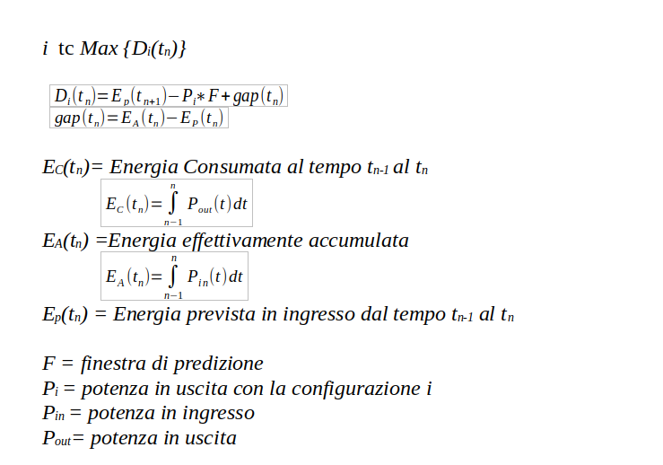

## 1) MAX FRAME RATE AL VARIARE DELLE FPGA
Quello che è dispendioso è la lettura delle immagini
### 1 FPGA 
60 immagini 2:17 min ( senza lettura 1:26) -> migliorato a  01:43 (fino a 1.24)

### 2FPGA 
60 immagini  2.07 min (senza lettura  1.14) -> migliorato a  1.26 (fino a 1.11)

### 3FPGA 
60 immagini 1.56  (senza lettura -> 1:11 ) -> migliorato a 1.19 ( fino a 1.04)

## 2) cambio potenza consumata al variare del frame rate
* fps    0,71 ~  87w
* fps    0,84 ~ 121w
* fps    0,93 ~ 155w

## 3) cambio potenza consumata al numero delle fpga
potenza in uscita 
+ spente:         ~  42w
+ 1 fpga attiva   ~  87w
+ 2 fpga attive   ~ 121w
+ 3 fpga attive   ~ 155w

## 4) variazione dinamica sobel filter

## 5) giornate significative
vedere file giornartesignificative.txt

<!-- ## 6) modello per nuovo algoritmo
    -->

## 6)  Modello Energetico

$$
i \, \text{tc} \, \text{Max} \{D_i(t_n)\}
$$

$$
D_i(t_n) = E_p(t_{n+1}) - P_i * F + \text{gap}(t_n)
$$

$$
\text{gap}(t_n) = E_A(t_n) - E_p(t_n)
$$

### Energia Consumata al tempo $t_{n-1}$ al $t_n$

$$
E_C(t_n) = \int_{n-1}^n P_{out}(t) \, dt
$$

### Energia effettivamente accumulata

$$
E_A(t_n) = \int_{n-1}^n P_{in}(t) \, dt
$$

### Energia prevista in ingresso dal tempo $t_{n-1}$ al $t_n$

$$
E_p(t_n) = \text{Energia prevista in ingresso dal tempo } t_{n-1} \text{ al } t_n
$$

#### Definizioni

- $i = configurazione i-esima
- $F$ = finestra di predizione
- $P_{loss}(t)$
- $P_{i}$ = potenza in uscita con la configurazione $i$
- $P_{in}$= potenza in ingresso
- $P_{out}$ = potenza in uscita

